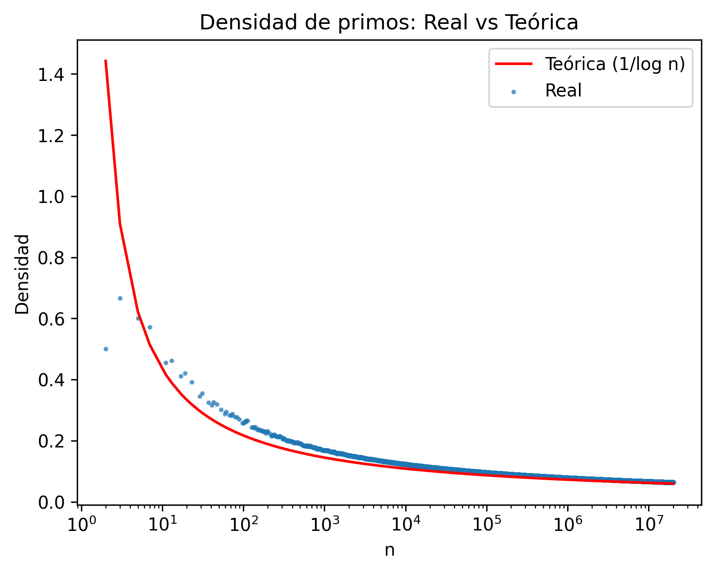
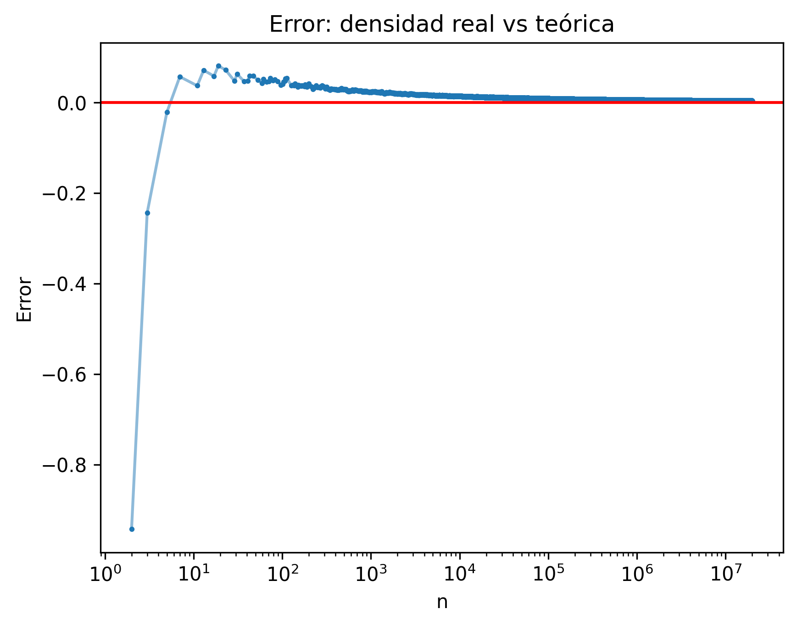
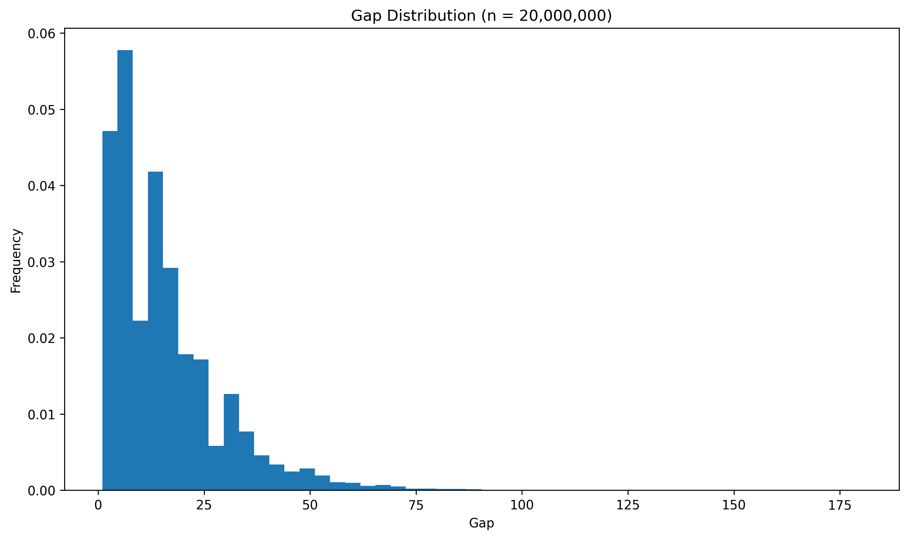
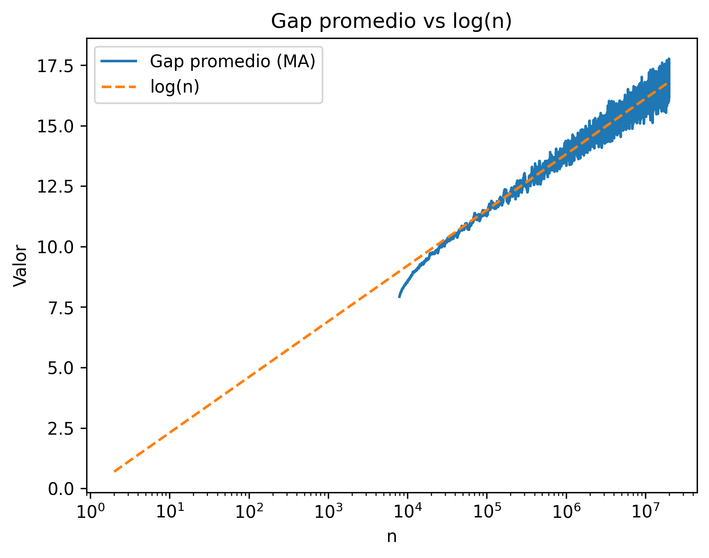
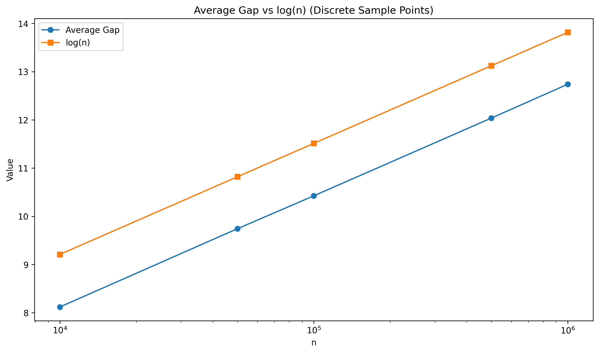
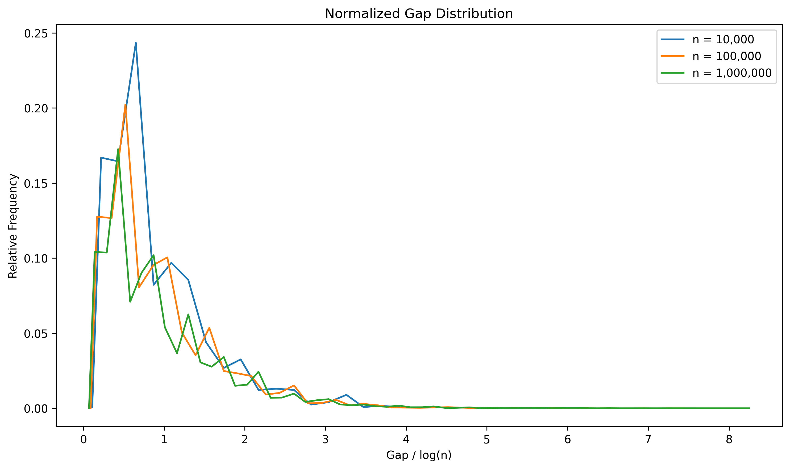

# 📊 Prime Analytics v2 — Empirical Study of Prime Numbers

---

## 🚀 Overview

This project explores the behavior of prime numbers from a data-driven perspective.

Starting from a simple question:

> Do prime numbers follow any pattern?

By generating primes up to 20 million and analyzing their statistical properties, the project reveals that while primes appear irregular at a local level, they follow consistent and predictable patterns at scale.

---

## 🎯 Objectives

The analysis focuses on:

- Prime density  
- Error vs theoretical approximation  
- Gap distribution  
- Growth of gaps  
- Relationship between gaps and log(n)  

---

## ⚙️ Data Generation

Prime numbers are generated using an optimized implementation of the **Sieve of Eratosthenes**:

```python
def criba(n):
    es_primo = np.ones(n + 1, dtype=bool)
    es_primo[:2] = False

    for i in range(2, int(np.sqrt(n)) + 1):
        if es_primo[i]:
            es_primo[i*i:n+1:i] = False

    return np.where(es_primo)[0]
```
🔹 Key features

Vectorized with NumPy
Efficient slicing instead of nested loops
Optimized for large-scale computation


📊 Dataset
From generated primes, a dataset is constructed with:

| Column        | Description                                     |
| ------------- | ----------------------------------------------- |
| prime         | Prime number                                    |
| index         | Position π(n)                                   |
| gap           | Distance between consecutive primes             |
| density\_real | π(n) / n                                        |
| density\_teo  | 1 / log(n)                                      |
| error         | difference between real and theoretical density |

📈 Key Results & Visualizations

🔹 1. Prime Density

Insight:

Empirical density approaches the theoretical curve
Confirms:

π(n) ~ n / log(n)


🔹 2. Error Analysis

Insight:

Error decreases as n grows
Oscillations reduce at larger scales
Model becomes more accurate


🔹 3. Gap Distribution

Insight:

Many small gaps
Few large gaps
Right-skewed distribution with long tail


🔥 🔹 4. Average Gap vs log(n) (Core Result)

Key Result:
The average gap between primes grows approximately as:
gap ~ log(n)

Important note:

The analysis focuses on n ≥ 10,000
This avoids early-stage noise and ensures statistical stability


🔹 5. Discrete Validation

Insight:

Independent validation at different values of n
Directly confirms consistency with log(n)


🔬 Advanced Analysis

🔹 Normalized Gap Distribution

Insight:
After normalizing gaps by log(n):

Distributions align
Shape remains stable

💥 Key conclusion:

Prime gaps exhibit scale-invariant behavior


🧠 Final Interpretation
Prime numbers exhibit:

❌ Local irregularity
✅ Global structure

"Primes appear chaotic individually, but follow clear statistical laws at scale."

n = 20,000,000
Execution time: depends on hardware

🧠 Key Takeaways

Prime density follows 1 / log(n) ✅
Error decreases with scale ✅
Gap distribution is stable ✅
Average gap grows as log(n) ✅
Normalized gaps show structural consistency ✅


📁 Project Structure
prime-analytics-v2/
│
├── Prime_Analytics_v2.py
├── plots/
│   ├── densidad_primos.png
│   ├── error_densidad.png
│   ├── hist_gaps.png
│   ├── gap_vs_log.png
│   ├── gap_promedio_vs_log.png
│   └── distribucion_gaps_normalizados.png
└── README.md


💡 Final Thought
This project shows how a seemingly random system can reveal consistent patterns when analyzed at scale.
It is not just about prime numbers — but about understanding how structure emerges from complexity.
